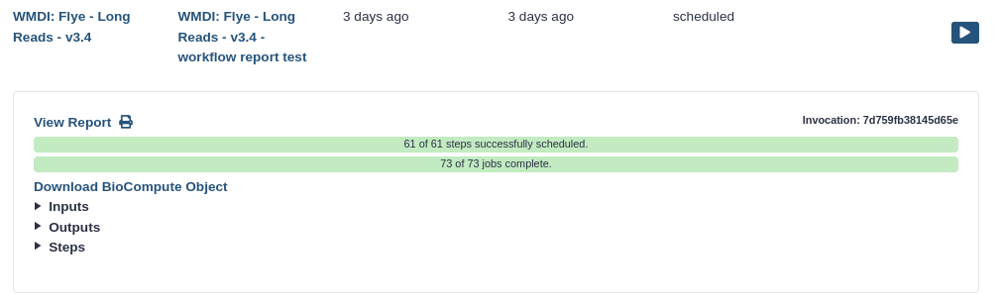
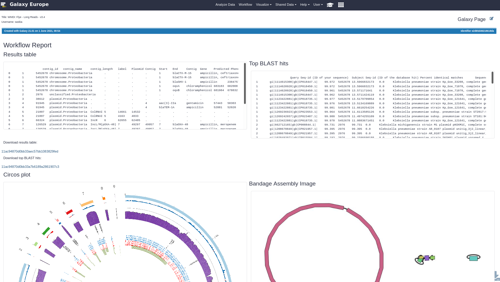
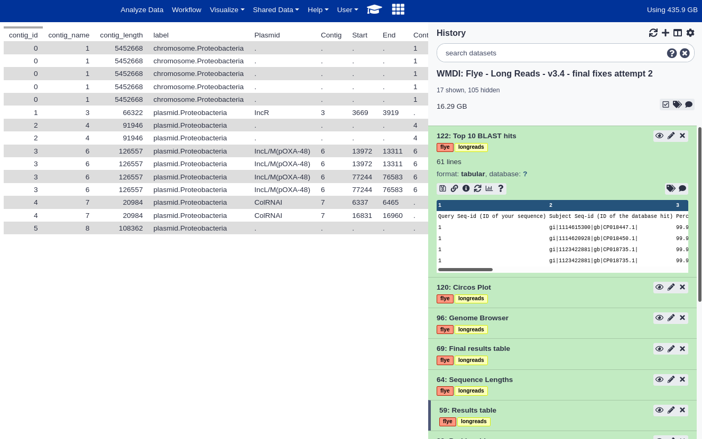

# EMC Analysis Pipelines

[Astrid: Short intro]

## Quickstart: Pipelines

Below are the latest versions of the Galaxy workflows (pipelines)

| Workflow                | Description                                      | Version |
|-------------------------|--------------------------------------------------|---------|
| [Flye](../Flye_longreads_v3.4.ga)         | Pipeline using the Flye assembler on long read data  |  3.4    |
| Unicycler hybrid        | Unicycler assembler on both short and long reads |         |
| Unicycler long-read     | Unicycler assembler on long read data            |         |
| Unicycler short-read    | Unicycler assembler on short read data           |         |
| Miniasm/Minimap         | Superseded by Unicycler workflows                |         |

**Note:** The Unicycler tool runs multiple rounds of Miniasm/Minimap, until no furhter improvement is found. The Miniasm/Minimap workflow listed in this table does only one such round and is provided here for testing and comparison purposes. In most cases the Unicycler pipeline will be preferred.

## Running the pipelines

- These workflows can be imported into the Galaxy server of your choice.
- We recommend using the European Galaxy server ([usegalaxy.eu](https://usegalaxy.eu)); it is free to use for anybody, and has a default of 250 GB of data storage.

### 1. Importing the Workflows into Galaxy

1. Log in or register at the Galaxy server of your choice (e.g. [Galaxy EU](https://usegalaxy.eu))
2. Copy the URL of the workflow from the table above (or download the file to your computer)
3. Follow the [instructions to import the workflow into Galaxy](https://training.galaxyproject.org/training-material/faqs/galaxy/workflows_import.html)

### 2. Running the workflow

1. Start a new history ([instructions](https://training.galaxyproject.org/training-material/faqs/galaxy/histories_create_new.html))
2. Upload your data
3. Create a collection with all your dataset in it ([instructions](https://training.galaxyproject.org/training-material/faqs/galaxy/collections_build_list.html))
4. Start the workflow ([instructions](https://training.galaxyproject.org/training-material/faqs/galaxy/workflows_run.html))

### 3. Viewing the results

#### A. Viewing the workflow report

Galaxy will create a workflow report for you with the various outputs combined into a single page.

1. Go to **"User"** in the top menu bar
2. Click on **"Workflow invocations"**
  - Here you will see all the workflows you have run
  - Click on your workflow name to expand it
3. Click on **View report**
  
4. You should see a report file a little like this:
  

This page can also be downloaded as a PDF.

#### B. View the full analysis history

To see more outputs, you can also browse the Galaxy *history*. Here you browse and download all the created output files

## Further Learning around Galaxy

There are a large number of tutorial around using Galaxy and performing a variety of scientific analyses. See the [Galaxy Training Network (GTN)](https://training.galaxyproject.org) for all tutorials.

## About the Tools

- [Flye documentation](https://github.com/fenderglass/Flye/blob/flye/docs/USAGE.md)
- [Medaka documentation](https://nanoporetech.github.io/medaka/)

