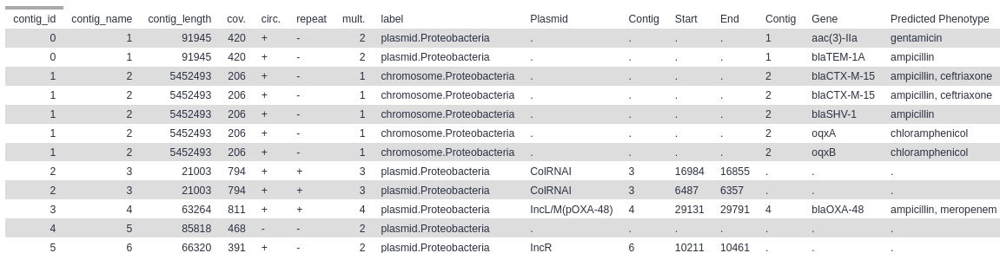
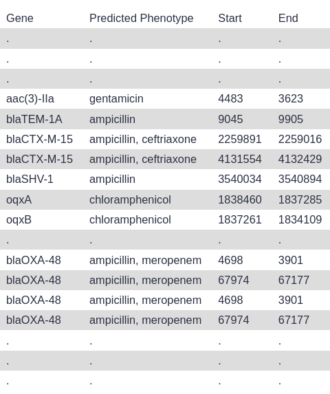
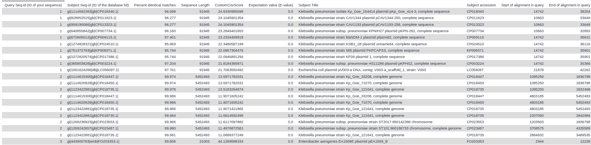
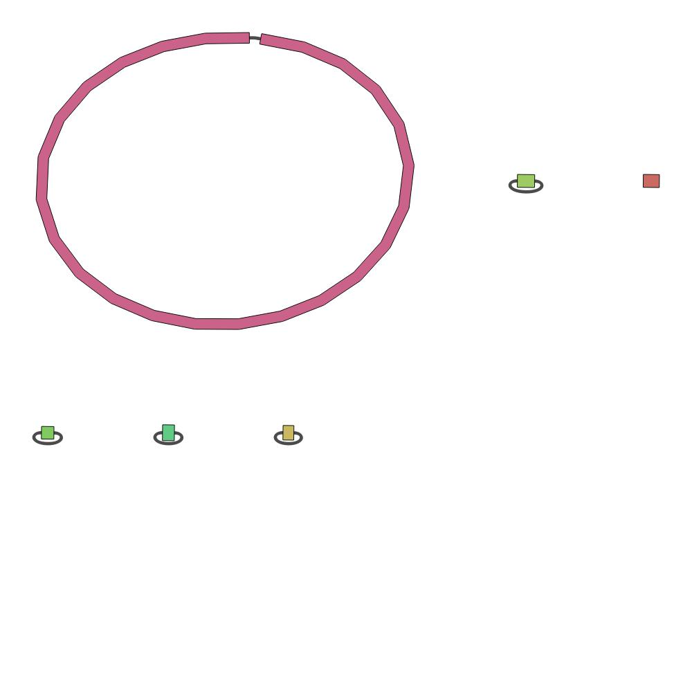
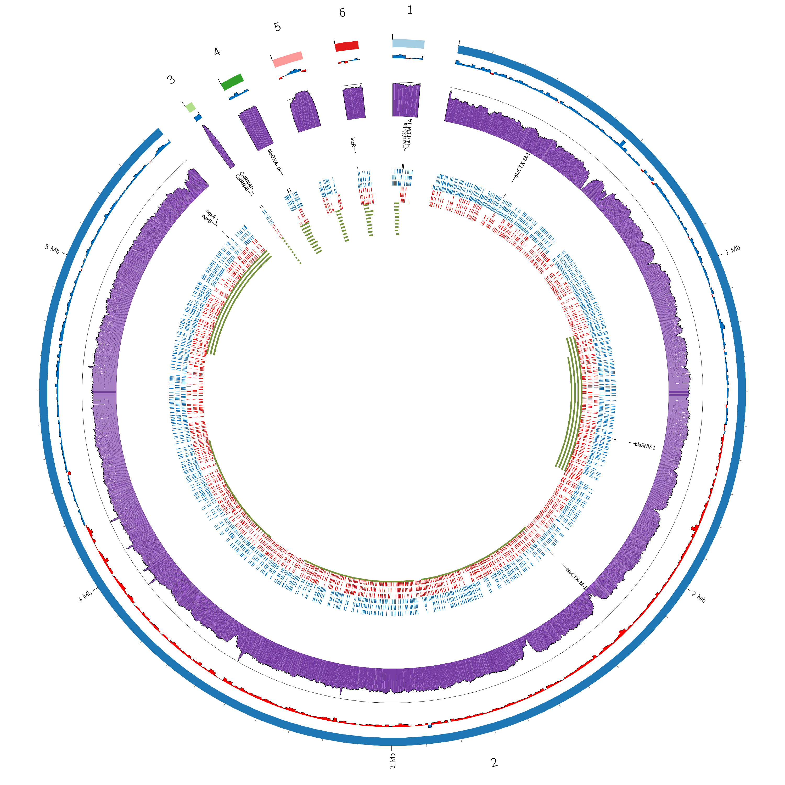

# EMC Galaxy Pipelines: Antimicrobial Analysis of Long-read data using Flye.

Rapid detection of resistant bacteria and corresponding antimicrobial resistance (AMR) mechanisms is of vital importance for adequate patient care, and prevention of further spread of resistant bacteria between patients in the hospital and in society. Mechanisms of antimicrobial resistance are encoded in the genome (chromosome and plasmids) of the bacteria. Plasmids in particular often encode multiple resistance genes, and can be relatively easily transfered from one bacteria to another, both within and between species. Therefore, plasmids are an important vector in the spread of resistance.

For rapid plasmid AMR detection, [Oxford Nanopore Technologies](https://nanoporetech.com) sequencing is very interesting. This techniques allows for the sequencing of long DNA-fragments (> 100.000 bp). Using these long reads, the full bacterial genome can be assembled, and we can distinguish between chromosomal and plasmid DNA. This allows us to determine whether resistance is encoded on the chromosome or on a plasmid, and allows us to estimate the risk of spread of this resistance.
`
This pipeline was created in coordination with the WMDI.

## Quickstart: Pipelines

Below are the links to the Galaxy workflows (pipelines)

| Workflow                | Description                                      | Version |
|-------------------------|--------------------------------------------------|---------|
| [Latest]({{site.baseurl}}/Flye_longreads_v3.4.ga)         | Pipeline using the Flye assembler on long read data  |  3.4    |

## Running the pipelines

- This workflow can be imported into the Galaxy server of your choice.
- We recommend using the European Galaxy server ([usegalaxy.eu](https://usegalaxy.eu)); it is free to use for anybody, and has a default of 250 GB of data storage.

## Example Run

We have made example dataset and an example run history available for on the European Galaxy server:
  - [Example Data in Galaxy](https://usegalaxy.eu/u/saskia/h/emc-amr-workflow-flye-example-data)
  - [Example Galaxy Run](https://usegalaxy.eu/u/saskia/h/emc-amr-workflow-flye-example-run)

## Running Yourself

### 1. Importing the Workflows into Galaxy

1. Log in or register at the Galaxy server of your choice (e.g. [Galaxy EU](https://usegalaxy.eu))
2. Copy the URL of the workflow from the table above (or download the file to your computer)
3. Follow the [instructions to import the workflow into Galaxy](https://training.galaxyproject.org/training-material/faqs/galaxy/workflows_import.html)

### 2. Running the workflow

1. Start a new history ([instructions](https://training.galaxyproject.org/training-material/faqs/galaxy/histories_create_new.html))
2. Upload your data
3. Create a collection with all your dataset in it ([instructions](https://training.galaxyproject.org/training-material/faqs/galaxy/collections_build_list.html))
4. Start the workflow ([instructions](https://training.galaxyproject.org/training-material/faqs/galaxy/workflows_run.html))

### 3. Viewing the results

After the workflow has completed, the results will be stored in your Galaxy *history*. Here you browse and download all the created output files

Below are screenshot of the results from the [example Galaxy run](https://usegalaxy.eu/u/saskia/h/emc-amr-workflow-flye-example-run). You can import this example run into your own Galaxy account to explore the example results in more detail.

#### Final Results table

#### Top 10 BLAST hits

#### Bandage Assembly plot

#### Circos Plot

## Further Learning around Galaxy

There are a large number of tutorial around using Galaxy and performing a variety of scientific analyses. See the [Galaxy Training Network (GTN)](https://training.galaxyproject.org) for all tutorials.

In particular, we recommend you look at the following tutorial:
 - [AMR detection of long-read plasmid data](https://training.galaxyproject.org/training-material/topics/metagenomics/tutorials/plasmid-metagenomics-nanopore/tutorial.html)

This tutorial employs a similar workflow to the one presented here.

## About the Tools

- [Flye documentation](https://github.com/fenderglass/Flye/blob/flye/docs/USAGE.md)
- [Medaka documentation](https://nanoporetech.github.io/medaka/)

